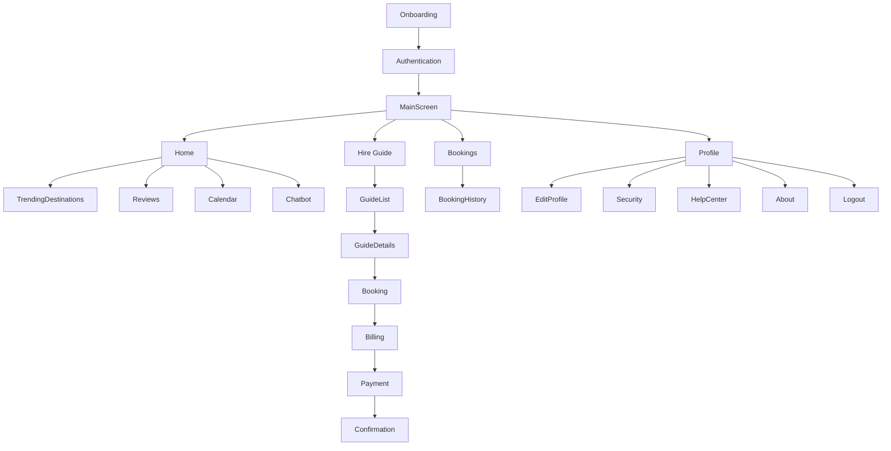
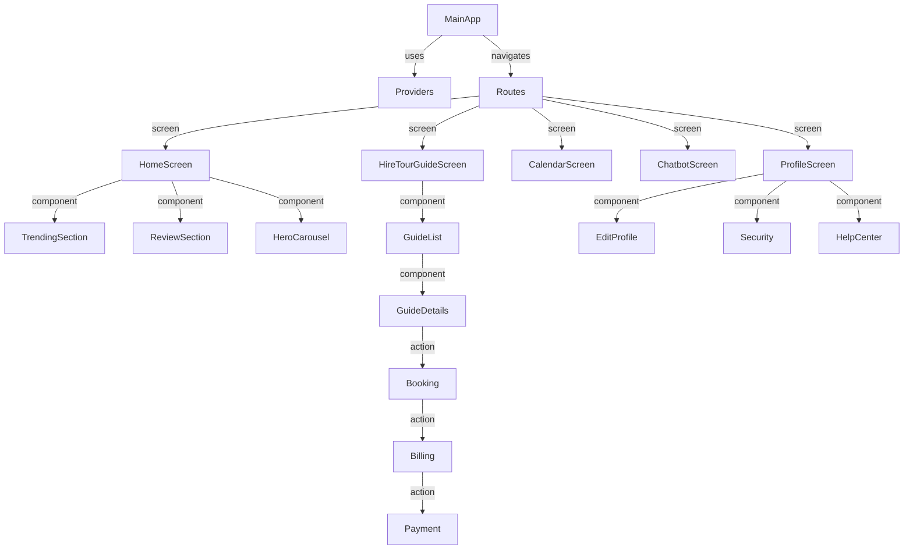

# Tour Guide Application

A modern, feature-rich Flutter app for discovering destinations, hiring tour guides, managing travel plans, and sharing your journey. 

---

## 🚀 Features

- **Onboarding Experience**: Engaging introduction for new users.
- **User Authentication**: Secure login, signup, and password reset.
- **Home Dashboard**: Trending destinations, reviews, and quick access to features.
- **City & Country Selection**: Choose your travel location easily.
- **Calendar & Event Management**: Plan and track your trips.
- **Chatbot Travel Assistant**: Get instant travel help and recommendations.
- **Hire a Tour Guide**: Browse, filter, and book local guides.
- **Album Creation & Media Upload**: Create albums, upload photos/videos, and view memories.
- **Map & Location Features**: Google Maps integration for navigation and selection.
- **QR Code Scanning**: Scan and confirm locations with QR codes.
- **Review & Feedback System**: Share and read reviews for guides and destinations.
- **Profile Management**: Edit profile, security, and settings.
- **Payment & Billing**: JazzCash/EasyPaisa integration for secure payments.
- **Help Center & Support**: Access FAQs and contact support.

---

## 🗺️ App Navigation (Mermaid Diagram)



---

## 🏗️ Project Structure (Simplified)



---

## 📱 Main Screens

- **Onboarding**: Welcome and introduction
- **Login/Signup**: User authentication
- **Home**: Dashboard, trending, reviews, calendar, chatbot
- **Hire Guide**: Browse, filter, and book guides
- **Bookings**: View and manage your bookings
- **Profile**: Manage account, security, help, and about
- **Album**: Create, upload, and view travel albums
- **Map**: Select and view destinations
- **QR Scanner**: Scan and confirm locations
- **Payment**: Secure payment and confirmation

---

## 🛠️ Getting Started

1. **Clone the repository:**
   ```bash
   git clone <repo-url>
   cd Tour_guide-main
   ```
2. **Install dependencies:**
   ```bash
   flutter pub get
   ```
3. **Run the app:**
   ```bash
   flutter run
   ```

---

## 📦 Key Dependencies

- `flutter`
- `provider`
- `supabase_flutter`
- `google_maps_flutter`
- `table_calendar`
- `image_picker`
- `video_player`
- `carousel_slider`
- `confetti`
- `flutter_rating_bar`
- `shimmer`
- `webview_flutter`
- `mobile_scanner` (QR)
- `qr_flutter`
- `shared_preferences`
- `permission_handler`
- `http`

---

## 🤝 Contributing

Contributions are welcome! Please open issues and submit pull requests for new features, bug fixes, or improvements.

---

## 📄 License

This project is licensed under the MIT License.

---

## 🙏 Acknowledgements

- Flutter & Dart Team
- Supabase
- Google Maps
- All open-source contributors 
